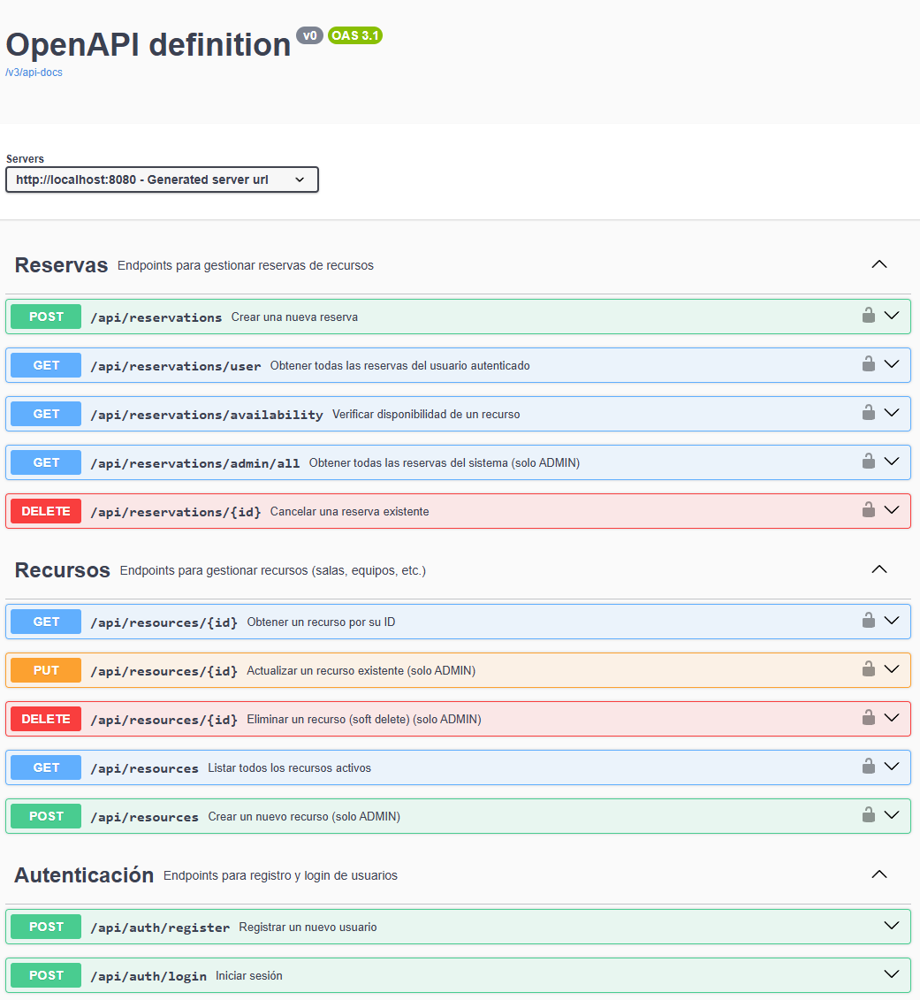

# Resource Booking API

API RESTful para la gestión de reservas de recursos compartidos con validación de conflictos de horario y autenticación JWT.

Diseñada para organizaciones que necesitan evitar reservas solapadas y administrar recursos de forma segura y escalable.

---

## 🚀 Tecnologías usadas

- Java 21
- Spring Boot 3
- Spring Security + JWT
- Spring Data JPA + Hibernate
- MySQL 8
- Flyway (migraciones)
- Swagger
- JUnit 5 + Mockito
- Maven

---

## ✨ Features

- Autenticación y autorización con JWT
- Control de acceso por roles (ADMIN / USER)
- Validación de conflictos de reservas (no doble reserva)
- Soft delete para recursos
- Endpoint de disponibilidad por recurso y horario
- Cancelación de reservas con reglas de negocio (mínimo 2 horas de anticipación)
- Manejo global de excepciones con @ControllerAdvice
- Tests unitarios con JUnit y Mockito
- Documentación interactiva con Swagger UI

---

## 🏗️ Arquitectura

```plaintext
Controller → Service → Repository → Database
```

## Estructura del proyecto

```plaintext
src/main/java/com/reservation
├── config/     # Configuraciones (Security, OpenAPI)
├── controller/ # Endpoints REST
├── model/
│ ├── dto/      # Objetos de transferencia
│ ├── entity/   # Entidades JPA
│ └── enums/    # Enumeraciones (Role, ReservationStatus)
├── exception/  # Excepciones personalizadas y manejador global
├── repository/ # Acceso a datos (JPA)
├── security/   # JWT y filtros de autenticación
└── service/    # Lógica de negocio
```
---

## 📡 Endpoints principales

### 🔑 Auth

| Método | Endpoint | Descripción | Acceso |
|--------|----------|-------------|--------|
| POST | `/api/auth/register` | Registrar nuevo usuario | Público |
| POST | `/api/auth/login` | Iniciar sesión (devuelve JWT) | Público |

**Ejemplo login:**
```json
{
  "email": "admin@coworking.com",
  "password": "admin123"
}

**Respuesta:**
```json
{
  "token": "eyJhbGciOiJIUzI1NiJ9...",
  "type": "Bearer",
  "email": "admin@coworking.com",
  "role": "ADMIN"
}

---

## 🏢 Resources

<table>
  <thead>
    <tr>
      <th>Método</th>
      <th>Endpoint</th>
      <th>Descripción</th>
      <th>Rol</th>
    </tr>
  </thead>
  <tbody>
    <tr>
      <td>GET</td>
      <td><code>/api/resources</code></td>
      <td>Listar recursos activos</td>
      <td>Autenticado</td>
    </tr>
    <tr>
      <td>GET</td>
      <td><code>/api/resources/{id}</code></td>
      <td>Obtener recurso por ID</td>
      <td>Autenticado</td>
    </tr>
    <tr>
      <td>POST</td>
      <td><code>/api/resources</code></td>
      <td>Crear recurso</td>
      <td>ADMIN</td>
    </tr>
    <tr>
      <td>PUT</td>
      <td><code>/api/resources/{id}</code></td>
      <td>Actualizar recurso</td>
      <td>ADMIN</td>
    </tr>
    <tr>
      <td>DELETE</td>
      <td><code>/api/resources/{id}</code></td>
      <td>Eliminar recurso (soft delete)</td>
      <td>ADMIN</td>
    </tr>
  </tbody>
</table>

---

## 📅 Reservations

<table>
  <thead>
    <tr>
      <th>Método</th>
      <th>Endpoint</th>
      <th>Descripción</th>
      <th>Rol</th>
    </tr>
  </thead>
  <tbody>
    <tr>
      <td>POST</td>
      <td><code>/api/reservations</code></td>
      <td>Crear reserva (con validación)</td>
      <td>Autenticado</td>
    </tr>
    <tr>
      <td>GET</td>
      <td><code>/api/reservations/user</code></td>
      <td>Ver reservas del usuario</td>
      <td>Autenticado</td>
    </tr>
    <tr>
      <td>GET</td>
      <td><code>/api/reservations/availability</code></td>
      <td>Ver disponibilidad</td>
      <td>Autenticado</td>
    </tr>
    <tr>
      <td>DELETE</td>
      <td><code>/api/reservations/{id}</code></td>
      <td>Cancelar reserva</td>
      <td>Owner/ADMIN</td>
    </tr>
    <tr>
      <td>GET</td>
      <td><code>/api/reservations/admin/all</code></td>
      <td>Ver todas las reservas</td>
      <td>ADMIN</td>
    </tr>
  </tbody>
</table>

**Ejemplo de crear reserva:**
```json
{
  "resourceId": 1,
  "startDateTime": "2026-05-10T10:00:00",
  "endDateTime": "2026-05-10T11:00:00"
}

---

## ⚠️ Reglas de negocio

- No se permiten reservas solapadas para el mismo recurso.
- Validación de conflictos usando:
  
```plaintext
existingStart < newEnd AND existingEnd > newStart
```

- `startDateTime` debe ser anterior a `endDateTime`
- No se pueden crear reservas en el pasado
- Solo se pueden cancelar reservas activas
- Las reservas solo pueden cancelarse con mínimo 2 horas de anticipación
- Los usuarios solo pueden cancelar sus propias reservas
- ADMIN puede cancelar cualquier reserva
- Los recursos utilizan soft delete (`isActive = false`)

---

## 📡 HTTP Status Codes

| Status Code | Descripción | Cuándo ocurre |
|-------------|-------------|---------------|
| 200 OK | Petición exitosa | GET, PUT, POST exitosos |
| 201 Created | Recurso creado | POST /api/resources, POST /api/reservations |
| 204 No Content | Éxito sin cuerpo | DELETE /api/reservations/{id} |
| 400 Bad Request | Error de validación | Datos inválidos en el body |
| 401 Unauthorized | Token inválido o ausente | JWT no enviado o expirado |
| 403 Forbidden | Permisos insuficientes | USER intenta crear recurso (solo ADMIN) |
| 404 Not Found | Recurso no existe | ID de recurso/reserva inexistente |
| 409 Conflict | Conflicto de negocio | Reserva en horario ya ocupado |
| 500 Internal Server Error | Error inesperado | Excepción no manejada |

---

## 🧪 Testing

El proyecto incluye:

- **Unit tests** con JUnit 5 y Mockito
- **Integration tests** con Spring Boot Test
- **Validación de conflictos** de reservas (evita doble reserva)
- **Tests de reglas de cancelación** (2 horas de anticipación, solo owner/ADMIN)
- **Tests de autenticación** con JWT

Ejecutar tests:

```bash
mvn test
```

---

## 📸 Cómo verlo en acción

### Swagger UI

```plaintext
http://localhost:8080/swagger-ui/index.html
```

## Demo / capturas



---

## 🧠 Lo que aprendí / mi rol

Desarrollé completamente la API backend aplicando arquitectura en capas con Spring Boot.

Implementé autenticación JWT, validación de conflictos de reservas, y manejo global de excepciones.

También trabajé con migraciones Flyway, testing unitario e integración usando Mockito y Spring Boot Test.

---

## ⚙️ Variables de entorno

Configurar en `application.properties`:

```properties
# Desarrollo local (con allowPublicKeyRetrieval para evitar errores de conexión)
# ⚠️ allowPublicKeyRetrieval=true es SOLO para desarrollo, NO usar en producción
spring.datasource.url=jdbc:mysql://localhost:3306/resource_booking_db?useSSL=false&allowPublicKeyRetrieval=true&serverTimezone=UTC
spring.datasource.username=booking_user
spring.datasource.password=tu_password

# Para producción, usa:
# spring.datasource.url=jdbc:mysql://localhost:3306/resource_booking_db?useSSL=true&serverTimezone=UTC

jwt.secret=tu_clave_secreta_generada_con_openssl_rand_hex_32
jwt.expiration=86400000
```

---

## 🔧 Cómo ejecutarlo localmente

### 1. Clonar repositorio

```bash
git clone https://github.com/UrieLara/Reservation-API.git
cd Reservation-API
```

### 2. Crear base de datos MySQL

```sql
CREATE DATABASE resource_booking_db;
CREATE USER 'booking_user'@'localhost' IDENTIFIED BY 'tu_password';
GRANT ALL PRIVILEGES ON resource_booking_db.* TO 'booking_user'@'localhost';
```

### 3. Configurar la contraseña del administrador

El archivo src/main/resources/db/migration/V1__create_initial_schema.sql contiene un usuario admin por defecto:

```sql
('Admin User', 'admin@coworking.com', '$2a$...6', 'ADMIN');
```

-- ⚠️ IMPORTANTE: La contraseña está encriptada con BCrypt.
-- Para generar tu propio hash:
-- 1. Ve a https://bcrypt-generator.com/
-- 2. Rounds: 10 (importante, debe coincidir con Spring Security)
-- 3. Escribe tu contraseña (ej: "admin123")
-- 4. Reemplaza el hash '$2a$10...' por el hash generado

### 4. Configurar application.properties
Copia application-example.properties a src/main/resources/application.properties y completa tus credenciales.
---

### 5. Ejecutar aplicación

```bash
mvn clean compile
mvn spring-boot:run
```

La aplicación estará disponible en:

```plaintext
http://localhost:8080
```

---

## 📚 Documentación API

Swagger UI:

```plaintext
http://localhost:8080/swagger-ui/index.html
```

---

## 👨‍💻 Autor

Desarrollado por UrieLara.